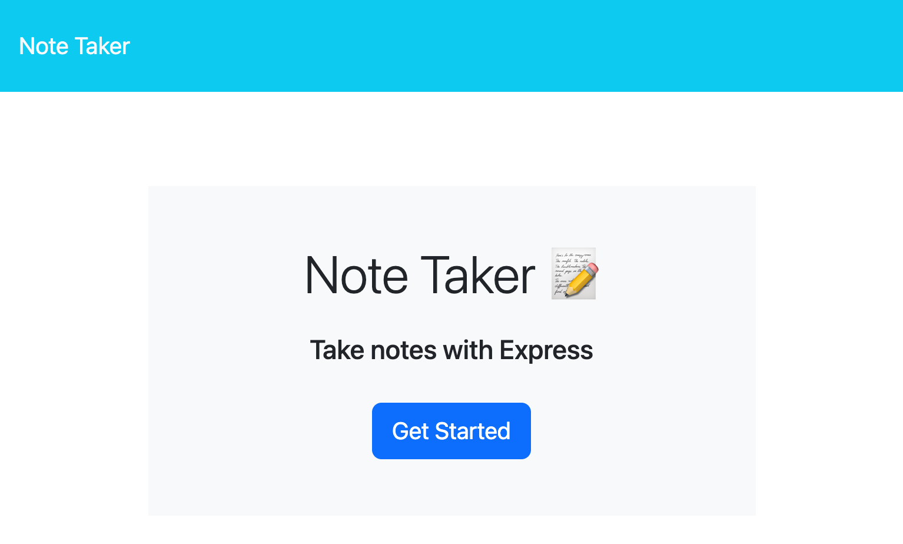
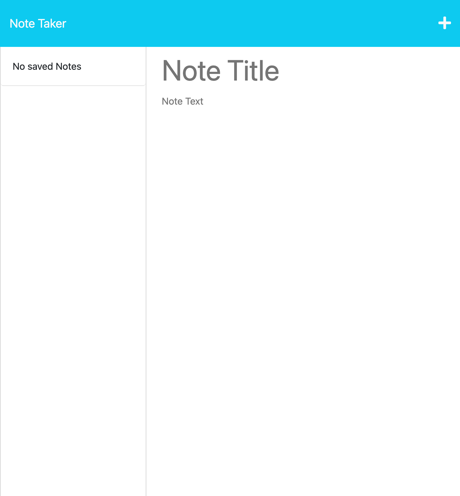

# Note-Taker 

## Description

This is a note taker appliction that uses express to send, save, and delete information of the server side of the web application. Enjoy writing down all your useful information on an easy to use plateform for storing notes!

## Table of Contents

- [Where to Find](#where-to-find🔌)
- [Usgae](#usage🔋)
- [Credits](#credits🙏🏻)
- [License](#license🔑)
- [Screenshot](#screenshot📸)

## Where-to-Find🔌
---
GitHub Repo: [Connor812-Note_taker](https://github.com/Connor812/Note-Taker.git)
Heroku Deployed Link: [Heroku Note Taker](https://connor812-note-taker.herokuapp.com/)

## Usage🔋

To use this application, visit [Note-taker](https://connor812-note-taker.herokuapp.com/) and click the button get started. On the right hand side, you can start by entering in your note title, and note text. When both are entered a save button will appear at the top right hand side of the page. Click to save your note. Say you mess up or no longer want a note. Beside that note there is a delete button.

## Credits🙏🏻

Shoutout to University of Toronto for teaching me how to code and all the UoT students who have gave me advice along the way.

## License🔑

GNU GENERAL PUBLIC LICENSE
Version 3, 29 June 2007

## Screenshot📸

